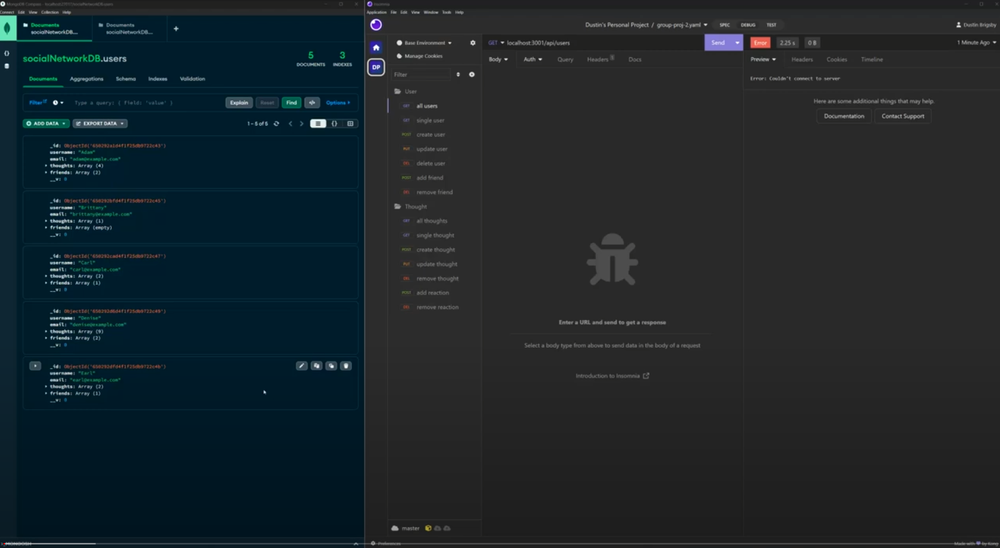

# Social-Network-API
 EdX Coding Bootcamp - Module 18 - NoSQL Challenge
 

## Table of Contents

- [Description](#description)
- [Installation](#installation)
- [Usage](#usage)
- [Screenshot](#screenshot)
- [License](#license)
- [Contributors](#contributors)
- [Test](#test)
- [Questions](#questions)

## Description

EdX/University of Oregon Coding Bootcamp Challenge:
 Build an API for a social network web application where users can share their thoughts, react to friends’ thoughts, and create a friend list.

## Installation

- [NodeJS v16.18.0](https://nodejs.org/dist/v16.18.0/node-v16.18.0-x64.msi) recommended
- [MongoDB](https://www.mongodb.com/)
- [Express.js](https://expressjs.com/en/4x/api.html)
- [Mongoose](https://mongoosejs.com/)

While in the root directory of the application, enter "npm install" into the terminal.

## Usage

Using Insomnia or other application that can simulate API fetch calls, use the API endpoints defined in the routes to manipulate the MongoDB NoSQL database.

## Screenshot

## License

MIT License
See [LICENSE](/LICENSE) file in contatining directory

## Contributors

Used the references and tutorials from:

- Multiple activities from 14-MVC class lessons and files.
- [Mongoose Documentation](https://mongoosejs.com/docs/guide.html)
- [MDN Web Docs](https://developer.mozilla.org/en-US/docs/Web/JavaScript)
- [W3 Schools](https://www.w3schools.com/mysql/default.asp)
- [Express documentation](https://expressjs.com/en/4x/api.html)

## Test

N/A

## Questions?

[GitHub Repository](https://github.com/dustybrigsby/Social-Network-API)

If not found there, you can email me at:

[dustybrigsby@gmail.com](mailto:dustybrigsby@gmail.com)
